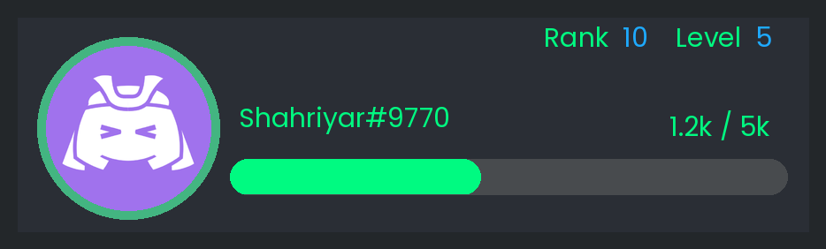
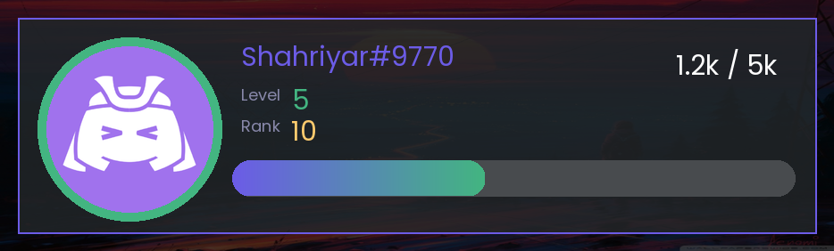
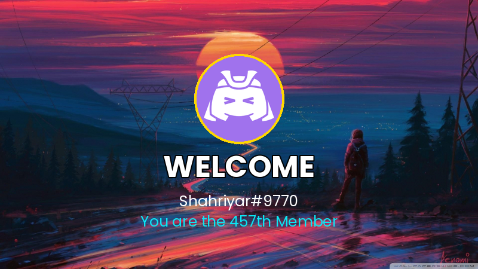
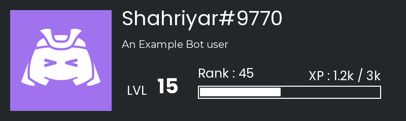

# Examples

## Rank Cards

> **[`rank_card_01.py`](rank_card_01.py)** — Classic dark card with XP bar, level display, polygon accent.

> **[`rank_card_02.py`](rank_card_02.py)** — Rich text rank/level display with progress bar and percentage.

> **[`rank_card_03.py`](rank_card_03.py)** — Background image card with gradient XP bar, rank/level via rich\_text.

## Welcome Images

> **[`welcome_image_01.py`](welcome_image_01.py)** — Polygon left panel with profile picture and welcome message.

> **[`welcome_image_02.py`](welcome_image_02.py)** — Full background image with gold-accent profile and member count.

## More

> **[`owo_level.py`](owo_level.py)** — Level card with bio, rank, XP bar and Montserrat font.

> **[`text_bg_color.py`](text_bg_color.py)** — Text background color using font bounding box measurement.

