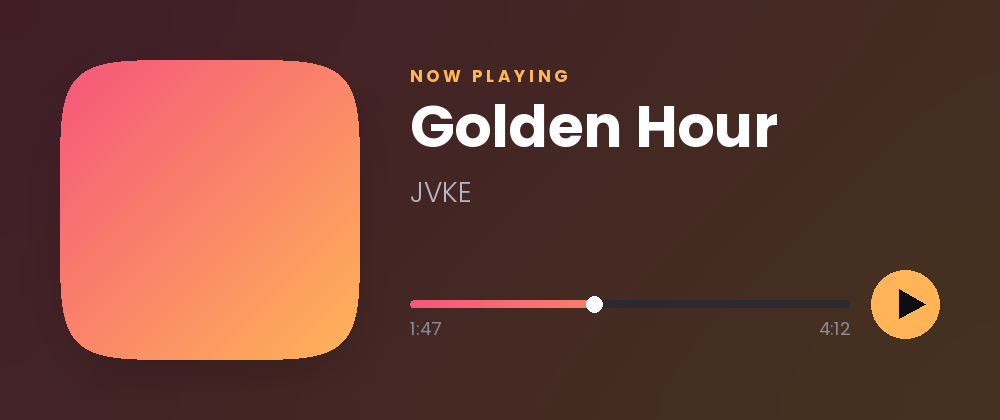
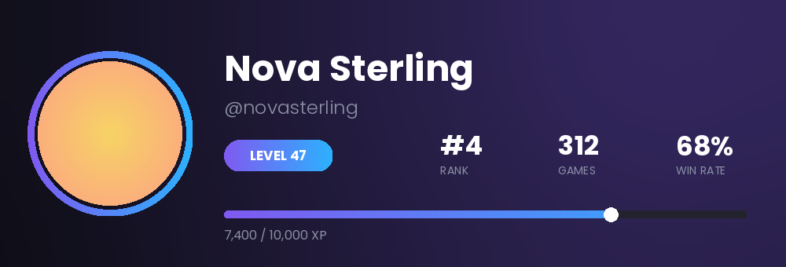
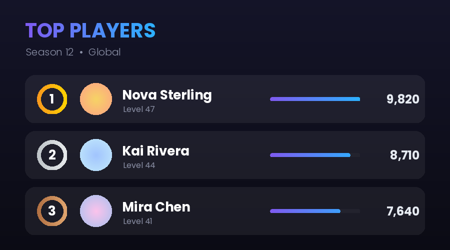
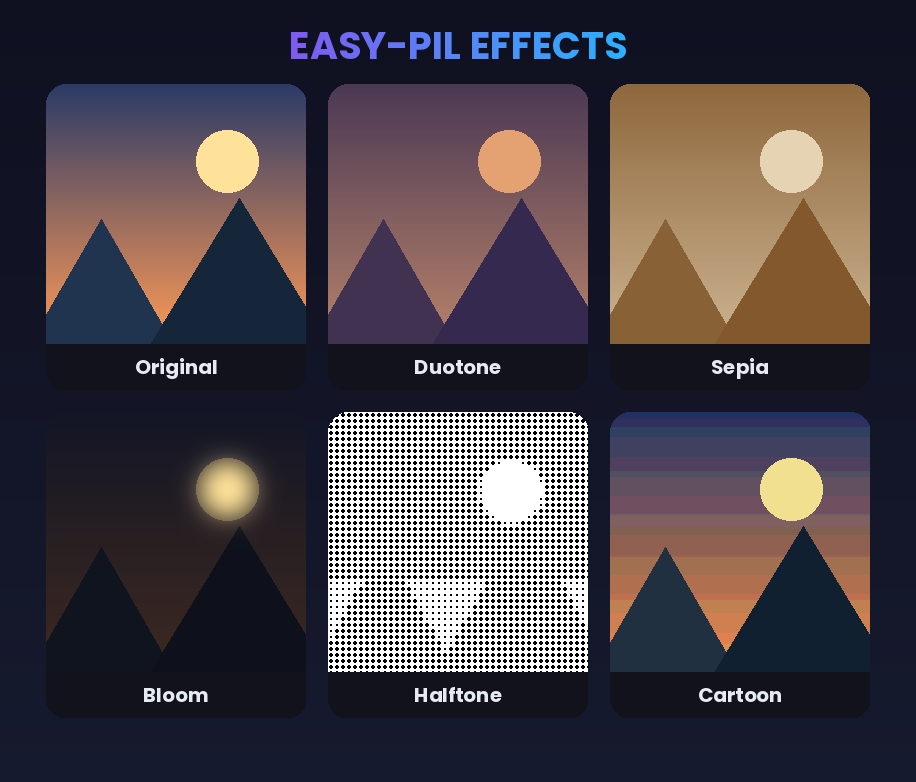
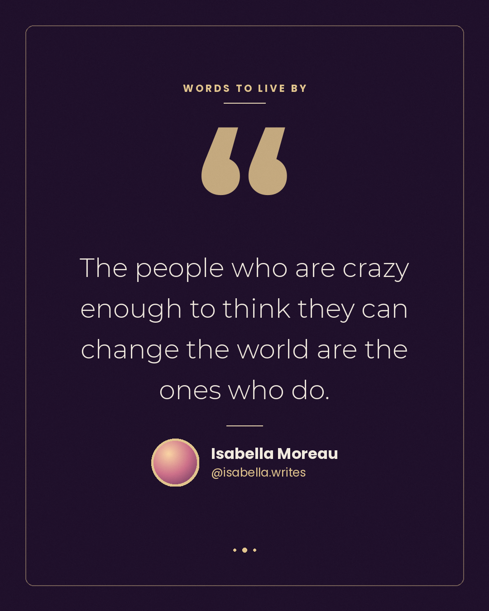
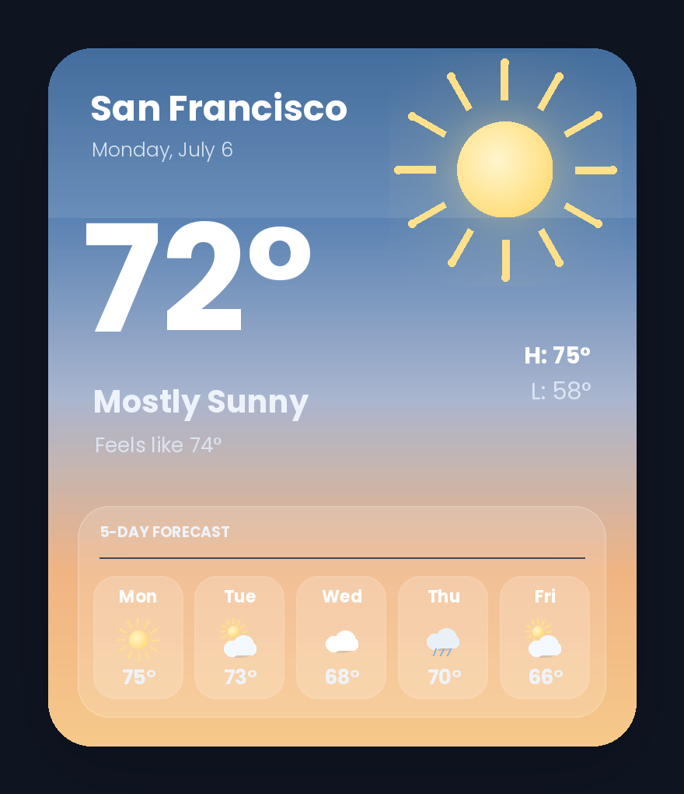
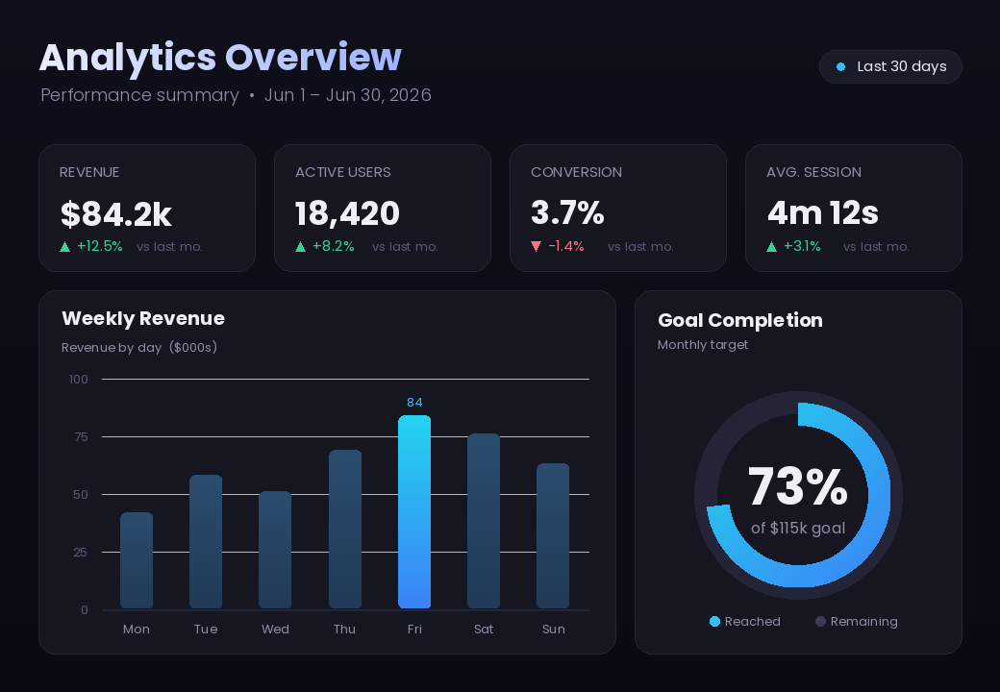
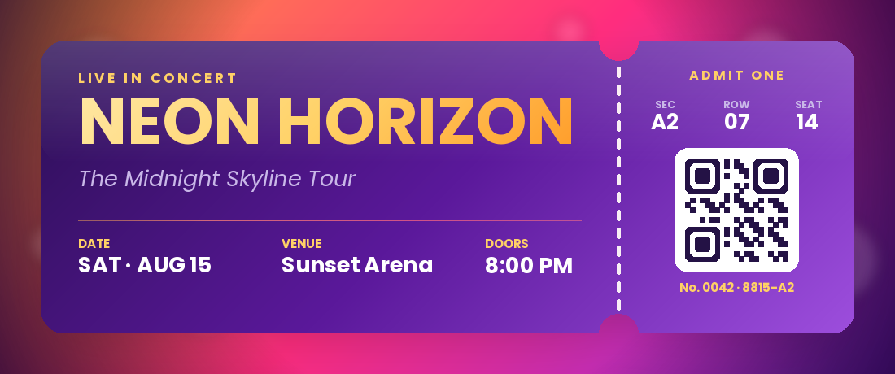
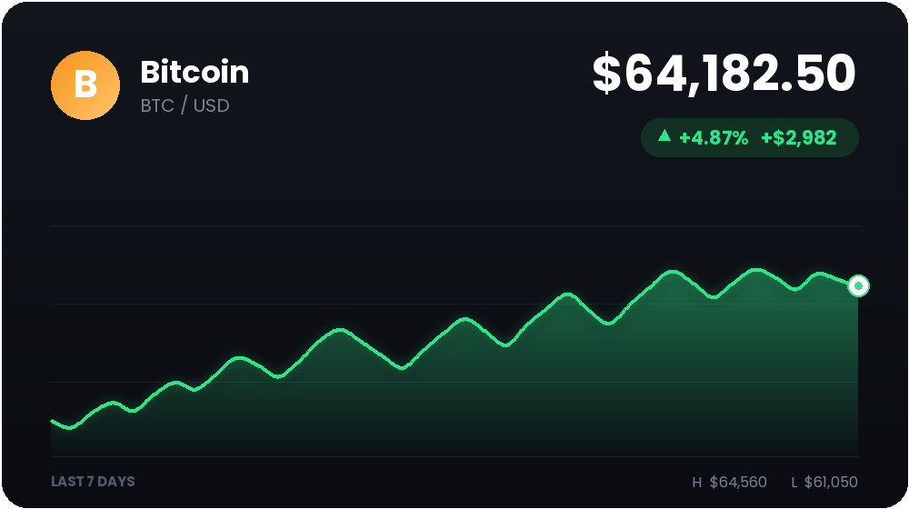
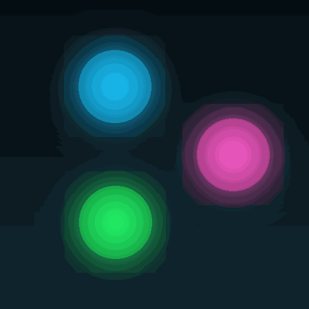

# easy-pil examples

Ten self-contained showcase scripts. Every one is **fully procedural** — no
external image, font, or network assets — so you can run them anywhere with just
`easy-pil` installed. Each renders a PNG into [`outputs/`](outputs).

```bash
# from the repo root, with easy-pil installed in your environment
python examples/music_card.py        # -> examples/outputs/music_card.png
```

Run them all:

```bash
for f in examples/*.py; do python "$f"; done
```

Each script writes to `examples/outputs/<name>.png` and prints the path.

---

## The gallery

### 🎵 Music card — `music_card.py`
Now-playing card with an ambient album-colour blur, a squircle cover with a soft
drop shadow, a gradient scrubber + knob, and an accent play button.
Uses: `squircle`, `Glow`, `blur`, `paste(opacity=…)`, `rounded_bar`, `regular_polygon`.



### 👤 Profile card — `profile_card.py`
Rank/profile card: avatar seated in a gradient donut ring, a level pill, a stat
row, and a slim gradient XP bar with a knob.
Uses: `donut`, `circle_image`, `gradient_text`, `rounded_bar`, `ColorOverlay`.



### 👋 Welcome banner — `welcome_banner.py`
Server welcome banner: centred avatar in a gradient ring, gradient headline, and
scattered star confetti over an ambient glow.
Uses: `gradient_text`, `star`, `donut`, `RadialGradient`, `paste("center")`.


### 🏆 Leaderboard — `leaderboard.py`
Top-players board with translucent row panels, gold/silver/bronze medal rings,
avatars, and per-row score bars.
Uses: `donut`, translucent panels via composited `paste`, `rounded_bar`, `gradient_text`.



### 🎨 Effects showcase — `effects_showcase.py`
A procedural sunset landscape run through Duotone, Sepia, Bloom, Halftone and
Cartoon, laid out as labelled rounded tiles.
Uses: `copy`, `effect(...)`, `rounded_corners`, `compose`.



### ❝ Quote card — `quote_card.py`
Editorial pull-quote card: big quotation mark, wrapped quote, and an author row
with a procedural avatar, on a rich gradient with a subtle grain + vignette.
Uses: `text_box`, `Vignette`, `Noise`, `circle_image`, `RadialGradient`.



### ⛅ Weather card — `weather_card.py`
iOS-style weather widget: a procedural sun (core + rays + glow), big temperature,
and a frosted 5-day forecast row with hand-built condition icons.
Uses: `ellipse`, `line`, `Glow`, glassy panels via `paste`, `rounded_corners`.



### 📊 Stats dashboard — `stats_dashboard.py`
Analytics dashboard: KPI tiles with ± deltas, a weekly bar chart with a
highlighted peak, and a donut arc goal-gauge.
Uses: `rectangle`, `arc`, `donut`, `triangle`, `gradient_text`.



### 🎟️ Event ticket — `event_ticket.py`
Concert ticket with a detachable stub, dashed perforation, punched notch
cut-outs, and a procedural QR code.
Uses: `rectangle`, dashed `line`, notch `ellipse`, `gradient_text`, `DropShadow`.



### 📈 Crypto ticker — `crypto_ticker.py`
Fintech price card: gradient coin badge, big price, up/down change pill, and a
smooth glowing sparkline with a gradient area fill.
Uses: `line` sparkline, area fill via masked `paste`, `Glow`, `regular_polygon` arrows.



### 🌀 Animated GIF — `animated_gif.py`
Builds a looping orbiting-orbs animation in memory, then uses `GifEditor` to
stylise **every frame** with queued ops (saturation + Bloom). GifEditor replays
the queue one decoded frame at a time, so memory stays bounded.
Uses: `GifEditor`, queued `saturation` + `effect(Bloom)`, `Glow`, `paste`.



---

> All cards are built with the public `easy_pil` API. Swap the procedural avatars
> for real ones with `Editor.from_url(...)` or `load_image(...)`.
